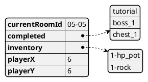
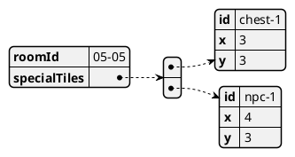

# Classes
# NOTES
- Save when go to new screen, exit combat, 
# Game

```plantuml
!include https://raw.githubusercontent.com/ganhaque/plantuml-theme/main/theme.yuml
class Game {
currentState: GameState*
...

+ run(): void
+ processInput(): void;
+ update(): void;
+ render(): void;

+ changeState(newState): void;
}

class GameState {
+ processInput(): void;
+ update(): void;
+ render(): void;
}

class Exploration {
+ processInput(): void;
+ update(): void;
+ render(): void;
}
class Combat {
+ processInput(): void;
+ update(): void;
+ render(): void;
}
class MainMenu {
+ processInput(): void;
+ update(): void;
+ render(): void;
}
```

---


```plantuml
!define Component Component
!define Interface Interface

package "Game" {
    [Game] as GameComponent <<Component>>

    [Play Audio] as AudioComponent <<Component>>
    [Handle User Input] as InputComponent <<Component>>
    [Render] as RenderingComponent <<Component>>

    GameComponent --> AudioComponent : Uses
    GameComponent --> InputComponent : Uses
    GameComponent --> RenderingComponent : Uses
}

```

```plantuml
digraph foo {
  node [style=rounded]
  node1 [shape=box]
  node2 [fillcolor=yellow, style="rounded,filled", shape=diamond]
  node3 [shape=record, label="{ a | b | c }"]

  node1 -> node2 -> node3
}
```

```plantuml
!include https://raw.githubusercontent.com/ganhaque/plantuml-theme/main/theme.yuml
Game -right-> GameState

enum GameState {
start_menu,
loading_overworld,
overworld,
loading_combat,
combat,
}


class Game {
screenWidth: int = 1920;
screenHeight: int = 1080;
gridWidth: int = 96;
gridHeight: int = 80;
overworldUIHeight: int = 120;

gameState: 

saveArray: bool[] = [false,false,...]

// saveData (will be saved & load from save.json)
gold: int = 0
currentRoomId: string = "05-05"
playTime: int = 0 // in seconds


+ run(): void
+ renderLoadingScreen(): void
+ renderOverworld(): void
- renderGrid(): void
+ renderCombat(): void
+ renderSaveMenu(): void
+ render...Menu(): void

+ loadSave(string fileName): void
+ saveSave(string fileName): void
}

Room --* Game
Player --* Game

```
# Player
```plantuml
!include https://raw.githubusercontent.com/ganhaque/plantuml-theme/main/theme.yuml

Player -right-> Direction
enum Direction {
left,
down,
up,
right
}

class Player {
// basics
playerId: string

// overworld
x: int
y: int
isAnimationLockOut: bool = false
facing: Direction::down
animationState: string

// combat
statuses: Vector<Status>
buff: Vector<Buff>

// shared
maxHp: int
currentHp: int
physicalDamage: int
magicalDamage: int
physicalDefense: int
magicalDefense: int
accuracy: float
dodge: float
omnivamp: int
---- equipments
weaponId: string
hatId: string
armorId: string
charmIds: string[]

+ Character(string playerId, int startX, int startY)
+ move(newX: int, newY: int): void
+ onTurnStart(): void
+ onTurnEnd(): void
+ handleAttackFromFoe(attack: Attack): void

}

```
# Room
```plantuml
!include https://raw.githubusercontent.com/ganhaque/plantuml-theme/main/theme.yuml
class Room {
roomId: string
overworldBg: Texture2D
overworldFg: Texture2D
combatBg: Texture2D
}

```
# Flow
```plantuml
!include https://raw.githubusercontent.com/ganhaque/plantuml-theme/main/theme.yuml

start
:run;
:loadSave;
:loadRoom;
end

```

# TODO
- Maybe separate texture & stuffs into a Sprite2D class?
- Rework Transition Tile
  - Change gridSize to +1, +1. The grid has 1 row & 1 column invisible to player
- Game variable should be initialize via JSON parsing
- Make a string parser helper classs that separate stuffs by "-"
  - Inventory items should be in the format "d-item_name"
  - Room should be in the format "d-d"
- Maybe: character has an overlay over the tile they are facing


# Helpers
```plantuml
!include https://raw.githubusercontent.com/ganhaque/plantuml-theme/main/theme.yuml

class StringParser {
+ static std::tuple<int, std::string> ParseString(const std::string& input);
}

```

# Example Save Data (save_data.json)


# Example room (05-05.json)



<br>
<br>
<br>
<br>
<br>
<br>
<br>
<br>
<br>
<br>
<br>
<br>
<br>
<br>
<br>
<br>
<br>
<br>
<br>
<br>
<br>
<br>
<br>
<br>
<br>
<br>
<br>
<br>
<br>
<br>
<br>
<br>
<br>
<br>
<br>
<br>
<br>
<br>
<br>
<br>
<br>
<br>
<br>
<br>
<br>
<br>
<br>
<br>

# Functions

## Game

```plantuml
!include https://raw.githubusercontent.com/ganhaque/plantuml-theme/main/theme.yuml

package parseRoomJSON(roomId: string) {
start
: find & load {roomId}.json;
: currentRoomId = room["roomId].asString();

repeat
:k++;
repeat while (true)

end
}

package loadRoom(roomId: string) {
start
: parseRoomJSON();
: find {roomId}-bg.png for room;
: find {roomId}-fg.png for room;
end
}

package run() {
start
: clearBackground(RAYWHITE);
: render room background;
: render character & objects;
: render room foreground;
end
}
```


---


```plantuml
@startuml
!include https://raw.githubusercontent.com/ganhaque/plantuml-theme/main/theme.yuml

start
:Input;
note right: "Input data"
:letters_only();
note right: "Extract letters"
:encode();
note right: "Encode as digits"
:coalesce();
note right: "Coalesce adjacent digits"
:discard_zeros();
note right: "Discard zeros"
:truncate_or_pad();
note right: "Pad or truncate to length 4"
stop

@enduml
```

# Mindmap
```plantuml
@startuml
@startmindmap
!include https://raw.githubusercontent.com/ganhaque/plantuml-theme/main/theme.yuml
+ root
**:right_1.1
right_1.2;
++ right_2

left side

-- left_1
-- left_2
**:left_3.1
left_3.2;
@endmindmap
@enduml
```

# State

```plantuml
!include https://raw.githubusercontent.com/ganhaque/plantuml-theme/main/theme.yuml

state choice1 <<choice>>
state fork1   <<fork>>
state join2   <<join>>
state end3    <<end>>

[*]     --> choice1 : from start\nto choice
choice1 --> fork1   : from choice\nto fork
choice1 --> join2   : from choice\nto join
choice1 --> end3    : from choice\nto end

fork1   ---> State1 : from fork\nto state
fork1   --> State2  : from fork\nto state

State2  --> join2   : from state\nto join
State1  --> [*]     : from state\nto end

join2   --> [*]     : from join\nto end

```

```plantuml
@startuml
!include https://raw.githubusercontent.com/ganhaque/plantuml-theme/main/theme.yuml


package "customer domain" {
class Contact {
+ email
+ phone
}

class Address {
+ address1
+ address2
+ city
+ region
+ country
+ postalCode
+ organization
}

note right of Address 
There are two types of 
addresses: billing and shipping
end note

class Customer {
}

Customer *-- Contact
Customer *-- ShippingAddress
Customer *-- BillingAddress
Customer *--{ SalesOrder

class ShippingAddress <<Address>>
class BillingAddress <<Address>>
class SalesOrder {
+ itemDescription
+ itemPrice
+ shippingCost
+ trackingNumber
+ shipDate
}
}
@enduml
```

# Object
```plantuml
@startuml
!include https://raw.githubusercontent.com/ganhaque/plantuml-theme/main/theme.yuml

object user1
user1 : name = "Dummy"
user1 : id = 123

object user2 {
name = "Dummy"
id = 123
}

object o1
object o2
diamond dia
object o3

o1  --> dia
o2  --> dia
dia --> o3
@enduml
```

# Deployment
```plantuml
@startuml
!include https://raw.githubusercontent.com/ganhaque/plantuml-theme/main/theme.yuml

actor actor
actor/ "actor/"
agent agent
artifact artifact
boundary boundary
card card
circle circle
cloud cloud
collections collections
component component
control control
database database
entity entity
file file
folder folder
frame frame
hexagon hexagon
interface interface
label label
node node
package package
person person
queue queue
rectangle rectangle
stack stack
storage storage
usecase usecase
usecase/ "usecase/"

@enduml
```
